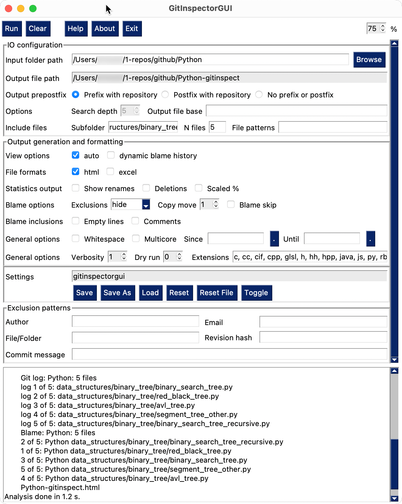
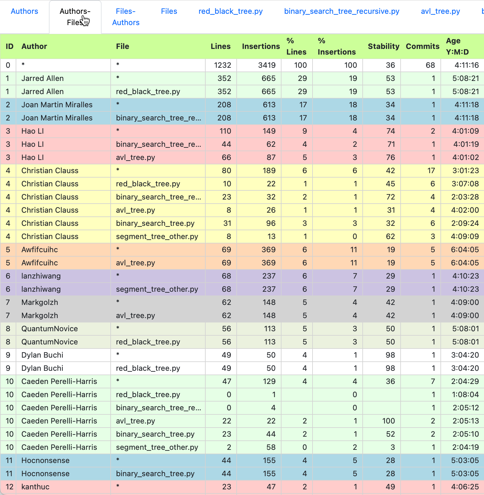
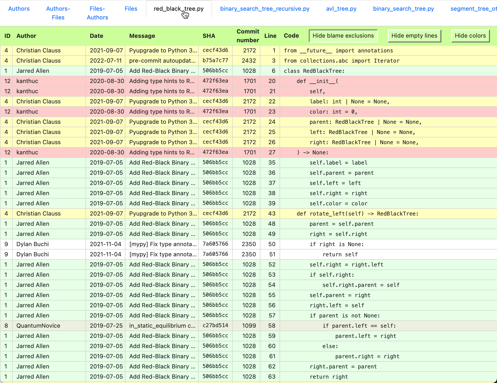
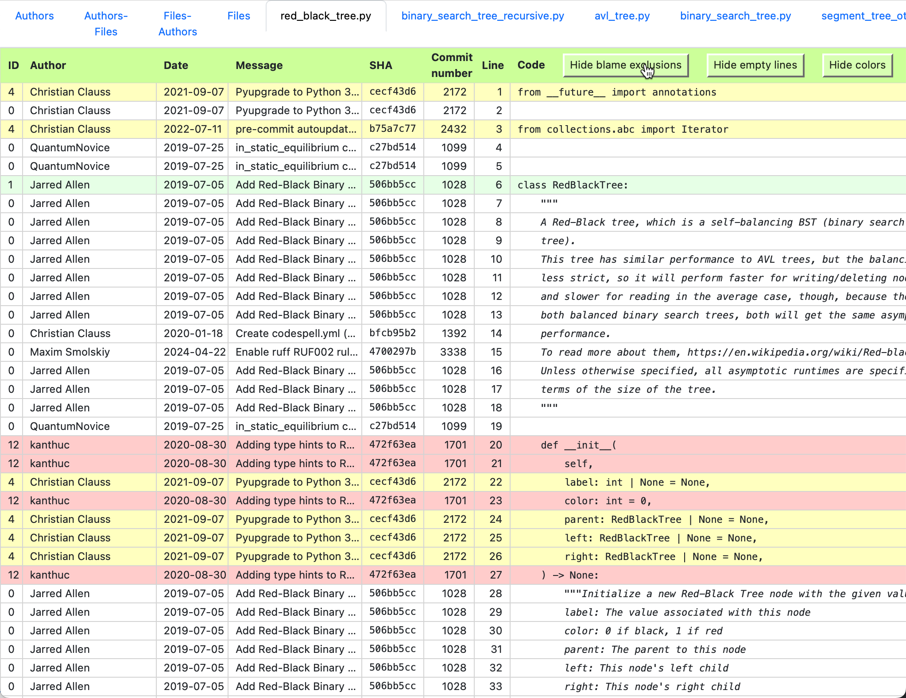

Examples
========
Below, some example output from the `Python Algorithms
<https://github.com/TheAlgorithms/Python>`_ project is shown.

    The GUI for the Python Algorithms project.

    Authors Files statistical output.

    Blame ouput with comments and empty lines excluded.

    Blame ouput without exclusions.
