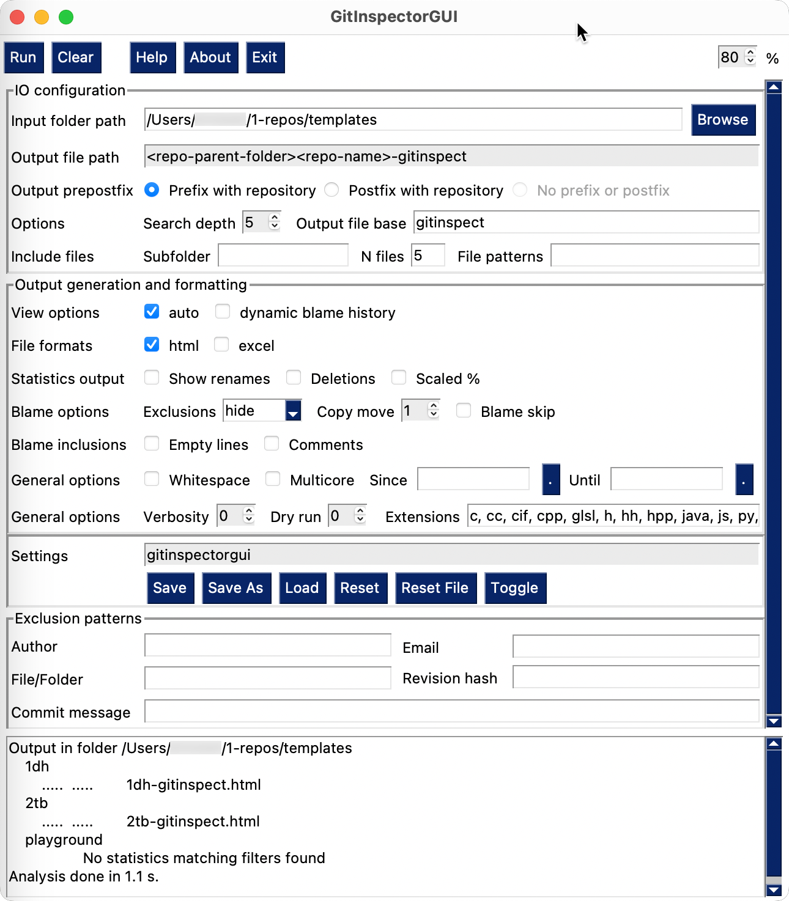

GUI: Graphical User Interface
=============================

GUI overview
------------
Below, a picture of the complete GUI on macOS.

  The GUI of gitinspectorgui on macOS.

The two main parts of the GUI are:

1. The grey input part at the top where the options are defined. This part can
   be scrolled up and down using the top scroll bar at the right.
2. The white console output part, where progress output is presented to the user
   while the repositories are analysed. The console has its own scrollbar.

Top row buttons
---------------
This row is unique to the GUI. It has the following buttons:

Execute
  Execute the analysis, using the parameters given in the GUI.

Clear
  Clear the console, which is the textual output box at the end of the GUI.

Help
  Presents a link to this online documentation to the user.

Exit
  Leave the GUI

Percentage box
  The percentage box at the far right, has small up and down triangles to
  increase or decrease the percentage. It defines the percentage of the total
  GUI, that is taken up by the input part of the GUI. The console takes up the
  remaining percentage.

  Adjusting the percentage box immediately updates the height of the input and
  console parts of the GUI. The height and width of the GUI can be changed by
  dragging the edges of the the GUI. The height of the input and console parts are
  updated when the height of the GUI has become stable after dragging.

Repository selection
--------------------
.. figure:: _files/gui-repo-select.png

Single local repository
^^^^^^^^^^^^^^^^^^^^^^^
Repository Path (selected in the picture)
  Enter the path to a single repository in the text box, or use
  the :guilabel:`Browse` button to select one, e.g:
  ``/Users/apple/repo``.

Output File Base
  The output filename, without extension and without parents. Default:
  ``gitinspect``.

Output File Option
  Select one of :guilabel:`Postfix with repo`,
  :guilabel:`Prefix with repo`, :guilabel:`No prefix or postfix` (default).

Output File Path
  Output File Path depends on selected Output File Option, e.g:

  * :guilabel:`Postfix with repo`: ``/Users/apple/repo-gitinspect``.
  * :guilabel:`Prefix with repo`: ``/Users/apple/gitinspect-repo``.
  * :guilabel:`No prefix or postfix`: ``/Users/apple/gitinspect`` (default).

  Note that the output file is not placed inside of the repository, but in
  its parent folder.

Multiple local repositories
^^^^^^^^^^^^^^^^^^^^^^^^^^^
Input Search Folder Path
  Enter a folder path in the text box, or select one using the :guilabel:`Browse`
  button. All repositories found in this folder and subfolders, up to a given
  depth, are analysed.

Search depth
  Positive integer value that represents the number of levels of subfolders
  that is searched for repositories, *default* ``5``. For depth ``1``, only
  the repository in the Search Folder, if present, is analysed.

Multiple output files
  If active and multiple repositories are found, present the output of every
  repository in its own output file, prefixing the Output File Base with the
  repository name.

Repo URLs
^^^^^^^^^
Repo URLs
  A comma separated list of repository URLs for analysis.

.. _general_config:

General configuration
---------------------
Extensions
    A comma separated list of file extensions to include when computing
    statistics. The default extensions used are: java, c, cc, cpp, h, hh,
    hpp, py, glsl, rb, js, sql.

    Specifying a single ``*`` asterisk character includes files with no extension.
    Specifying two consecutive ``**`` asterisk characters includes all files
    regardless of extension.

Hard
  .. include:: opt-hard.inc

Localize
  By default, the generated statistics are in English. This flag localizes the
  generated output to the selected system language if a translation is available.

Weeks
	Show all statistical information in weeks instead of in months.

Since
	Enter a date in the text box in the format 31/12/2022, or select one using the
	:guilabel:`.` button. Only show statistics for commits more recent than the
	given date.

Until
	Only show statistics for commits older than the given date.

Output formats excel and csv
----------------------------
Format
  Selects the formats for which  output is generated: :guilabel:`excel`,
  :guilabel:`csv`. See :doc:`output-formats`.

Scaled percentages
  For each column with output in percentages, e.g. :guilabel:`Changes %`, add a
  column :guilabel:`Scaled changes %`, which equals the value of
  :guilabel:`Changes %` multiplied by the number of authors in the repository.

Show files `N`
  Generate output for the first `N` files with the highest number of insertions
  for each repository. For excel, this results in three worksheets:
  :guilabel:`Authors`, :guilabel:`Authors-Files` and :guilabel:`Files`. The
  worksheet :guilabel:`Authors` combines the results of all files, the worksheet
  :guilabel:`Authors-Files` shows results per author and per file, and the
  worksheet :guilabel:`Files` combines the results of all authors.

Merged repositories
  Merge commit information from found repositories as if coming from a single
  repository.

Output formats text ... html
----------------------------
Note that for these output formats, output from multiple repositories is always
merged. This behavior is equivalent to the ``--merged-repositories`` option for
the output formats excel and csv.

Format
  Selects the formats for which  output is generated: :guilabel:`text`
  *default*, :guilabel:`html`, :guilabel:`htmlembedded`, :guilabel:`json`,
  :guilabel:`xml`. See :doc:`output-formats`.

Metrics
	Include checks for certain metrics during the analysis of commits.

Timeline
	Show commit timeline, including author names.

List file types
  List all the file extensions available in the current branch of the repository.

Responsibilities
	Show which files the different authors seem most responsible for.

.. _exclusion_pattern:

Exclusion patterns
------------------
File/Path
	Filter out all files (or paths) containing any of the comma separated strings
	in the text box, e.g. myfile, test.

Author
  Filter out all author names containing any of the comma separated strings in
  the text box, e.g. John, Mary.

Email
  Filter out all email addresses containing any of the comma separated strings in
  the text box, e.g. @gmail.com, john.

Revision hash
  Filter out all revisions containing any of the comma separated hashes/SHAs in
  the text box, e.g. 8755fb33, 12345678.

Commit message
  Filter out all commit messages containing any of the comma separated strings in
  the text box, e.g. fix, bug.

Apart from substring matching, as described above, regular expressions
can also be used as exclusion pattern, e.g.:

* Author text box is: ``^(?!(John Smith))``
  Only show statistics from author ``John Smith``, by excluding all authors that
  are not John Smith.

* Author test box is: ``^(?!([A-C]))``
  Only show statistics from authors starting with the letters ``A/B/C``.

* Email text box is: ``.com$``
  Filter out statistics from all email addresses ending with ``.com``.
