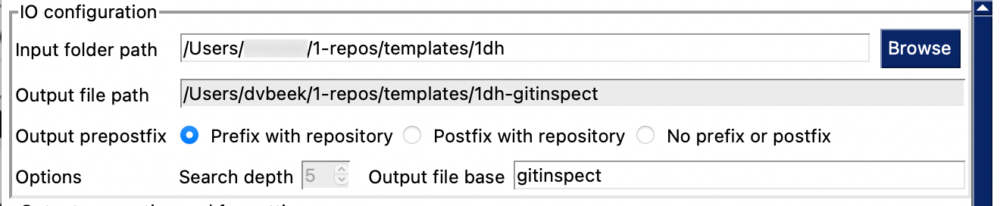
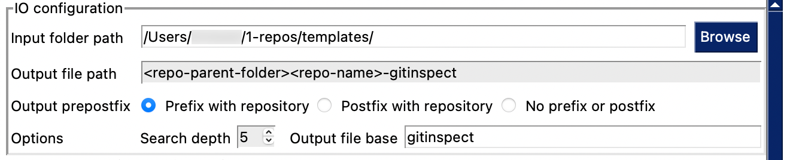

GUI: Graphical User Interface
=============================

GUI overview
------------
Below, a picture of the complete GUI on macOS.

.. figure:: _files/gui.png

  The GUI of gitinspectorgui on macOS.

The two main parts of the GUI are:

1. The grey input part at the top where the options are defined. This part can
   be scrolled up and down using the top scroll bar at the right.
2. The white console output part, where progress output is presented to the user
   while the repositories are analysed. The console has its own scrollbar.

Top row buttons
---------------
This row is unique to the GUI. It has the following buttons:

Execute
  Execute the analysis, using the parameters given in the GUI.

Save
  Save all settings specified in the GUI.

Clear
  Clear the console, which is the textual output box at the end of the GUI.

Help
  Presents a link to this online documentation to the user.

Exit
  Leave the GUI

Percentage box
  The percentage box at the far right, has small up and down triangles to
  increase or decrease the percentage. It defines the percentage of the total
  GUI, that is taken up by the input part of the GUI. The console takes up the
  remaining percentage.

  Adjusting the percentage box immediately updates the height of the input and
  console parts of the GUI. The height and width of the GUI can be changed by
  dragging the edges of the the GUI. The height of the input and console parts
  are updated when the height of the GUI has become stable after dragging.

IO configuration
----------------
Input folder path
  Enter a folder path in the text box, or select one using the :guilabel:`Browse`
  button.

.. _input-is-repo:

Input folder path is a repository
^^^^^^^^^^^^^^^^^^^^^^^^^^^^^^^^^

If the input folder path is a repository, that repository is analysed and no
search for addtional repositories takes place.

Output file base
  The output filename, without extension and without parents. Default:
  ``gitinspect``.

Output file path
  Output file path depends on selected output prepostfix (see next option). In
  the example figure, the input folder path is the path of the repository
  gitinspectorgui. Depending on the selected pre or postfix, the output file
  path is:

  * :guilabel:`Postfix with repo`: ``/Users/.../1-repos/grading/gitinspectorgui-gitinspect``.
  * :guilabel:`Prefix with repo`: ``/Users/.../1-repos/grading/gitinspect-gitinspectorgui``.
  * :guilabel:`No prefix or postfix`: ``/Users/.../1-repos/grading/gitinspect``.

Output prepostfix
  Select one of :guilabel:`Postfix with repo`,
  :guilabel:`Prefix with repo`, :guilabel:`No prefix or postfix` (default).

  Note that the output file is not placed inside of the repository, but in
  its parent folder.

Search depth
  Disabled and ignored in this case.

Input folder path is a folder but not a repository
^^^^^^^^^^^^^^^^^^^^^^^^^^^^^^^^^^^^^^^^^^^^^^^^^^

If the input folder path is not a repository, all folder and subfolders up to
the value of the :guilabel:`Search depth` option are searched for repositories
and the repositories found are analysed. The output file for each repository
found is placed in the parent directory of the repository.

Output file base
  For each repository found, the output file base is as specified for the case
  :ref:`input-is-repo`.

Output file path
  For each repository found, the output file path is as specified for the case
  :ref:`input-is-repo`.

Output prepostfix
  For the values :guilabel:`Postfix with repo` and :guilabel:`Prefix with repo`,
  the output file path for each repository found is as specified for the case
  :ref:`input-is-repo`.

  The value :guilabel:`No prefix or postfix` behaves differently. For this
  option, only a single output file is generated in the input folder path.

  The contents of this file is depends on the output format.

  For output format Excel, the Excel file contains the analysis results for each
  individual repository seperated from the other repositories in a single Excel
  file. Each worksheet has an additional column which specifies the name of the
  repository. No blame worksheets are generated.

  For output format text, the single text file contains the analysis results of
  all repositories merged together as if coming from a single repository.

Search depth
  Positive integer value that represents the number of levels of subfolders
  that is searched for repositories, *default* ``5``. For depth ``1``, only
  the repository in the input folder path, if present, is analysed.

Output format excel
-------------------
Selects whether output for the :guilabel:`excel` format is generated. See
:doc:`output-formats`.

Options
^^^^^^^
Scaled percentages
  For each column with output in percentages, e.g. :guilabel:`Changes %`, add a
  column :guilabel:`Scaled changes %`, which equals the value of
  :guilabel:`Changes %` multiplied by the number of authors in the repository.

Skip blame
  Do not output Excel blame sheets, as explained below.

Subfolder
  Restrict analysis of the files of the repository to the files in this folder
  and its subfolders.

File selection
^^^^^^^^^^^^^^
Show N files
  Generate output for the first `N` files with the highest number of insertions
  for each repository. For excel, this results in four worksheets:
  :guilabel:`Authors`, :guilabel:`Authors-Files` and :guilabel:`Files`. The
  worksheet :guilabel:`Authors` combines the results of all files, the worksheet
  :guilabel:`Authors-Files` and :guilabel:`Files-Authors` show results per
  author and per file, and the worksheet :guilabel:`Files` combines the results
  of all authors.

  In addition, for each of the N files, a blame worksheet is generated, unless
  the option :guilabel:`Skip blame` is active, see :ref:`blame-sheets-gui`.

Show files
  Show only files matching the specified pattern. If a pattern is
  specified, it takes priority over the value of N in option :guilabel:`Show N
  files`, which is then ignored. When a pattern is present, the :guilabel:`Show
  N files` option is disabled.

  To show all files, use the pattern ``.*``.

.. _blame-sheets-gui:

Excel blame worksheets
^^^^^^^^^^^^^^^^^^^^^^
A blame worksheet shows the contents of each file and indicates for each line
in the file in which commit the line was last changed, at which date and by
which author.

Output format text
------------------
Selects whether output for the :guilabel:`text` format is generated. See
:doc:`output-formats`. For this output format, output from multiple repositories
is always merged as if coming from a single repository.

Extensions list
  Output a list of file extensions used in the current branch of the
  repository.

.. _general_config:

General configuration
---------------------
Deletions
  Include a column for Deletions in the output. This does not affect the blame
  output, because deleted lines cannot be shown. The default is not to include
  deletions.

Whitespace
    Include whitespace changes in the statistics. This affects the statics and
    the blame output. The default setting is to ignore whitespace changes.

Empty lines
  Include empty lines in the blame calculations. This affects the color of the
  empty lines in the blame sheets.

  The default is not to include them and show all empty lines in the blame
  sheets as white.

  When this setting is active, empty lines are shown in the color of their
  author.

Comments
  Include whole line comments in the blame calculations. This affects the number
  of lines of each author.

  The default is not to include whole line comments, which means that such lines
  are not attributed to any author and are shown in the blame sheets as white.
  Whole line coments are not counted in the Lines column of the statistics
  output, potentially causing the sum of the Lines column to be less than the
  total number of lines in the file.

  When this setting is active, whole line comments are shown in the color as of
  their author and are counted in the Lines column of the statistics output.

Copy move
  .. include:: opt-hard.inc

Months
	Show all statistical information in weeks instead of in months.

Since
	Enter a date in the text box in the format 31/12/2022, or select one using the
	:guilabel:`.` button. Only show statistics for commits more recent than the
	given date.

Until
	Only show statistics for commits older than the given date.

Extensions
    A comma separated list of file extensions to include when computing
    statistics. The default extensions used are: java, c, cc, cpp, h, hh,
    hpp, py, glsl, rb, js, sql, cif, tooldef.

    Specifying a single ``*`` asterisk character includes files with no extension.
    Specifying two consecutive ``**`` asterisk characters includes all files
    regardless of extension.

.. _exclusion_pattern:

Exclusion patterns
------------------
File/Path
  Filter out files (or paths) containing any of the comma separated strings
  in the text box. E.g. ``myfile, test`` excludes files ``myfile.py`` and
  ``testing.c``.

Author
  Filter out author names containing any of the comma separated strings in
  the text box. E.g. ``John`` excludes author ``John Smith``.

Email
  Filter out email addresses containing any of the comma separated strings
  in the text box. E.g. ``@gmail.com`` excludes all authors with a gmail
  address.

Revision hash
  Filter out revisions containing any of the comma separated hashes/SHAs in the
  text box. When used with short hashes, the caret ``^`` is needed to make sure
  that only hashes starting with the specified string are excluded. E.g.
  ``^8755fb33,^12345678`` excludes revisions that start with ``8755fb33`` or
  ``12345678``.

Commit message
  Filter out commit messages containing any of the comma separated strings in
  the text box. E.g. ``bug, fix`` excludes commits from analysis with commit
  messages such as ``Bugfix`` or ``Fixing issue #15``.

Matches are case insensitive, e.g. ``mary`` matches ``Mary`` and ``mary``, and
``John`` matches ``john`` and ``John``.

Matching is based on `python regular expressions
<https://docs.python.org/3/library/re.html>`_. Some additional examples of
patterns in the File text box:

``^init``
  Filter out statistics from all files starting with ``init``, e.g. ``init.py``.

``init$``
  Filter out statistics from all files ending with ``init``, e.g. ``myinit``.

``^init$``
  Filter out statistics from the file ``init``.

``init``
  Filter out statistics from all files containing ``init``, e.g. ``myinit``,
  ``init.py`` or ``myinit.py``.
